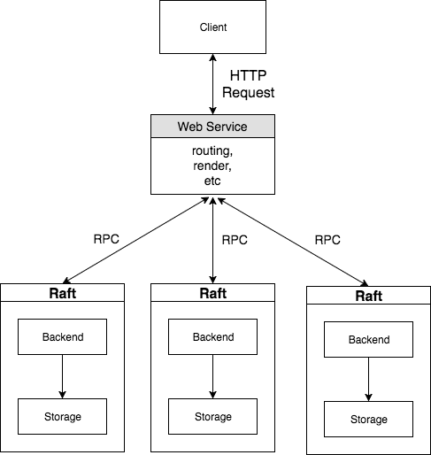

# Structure

cmd
|-- web
| `-- web.go --> build target (the code that actually runs the server)
web
|-- web.go
|-- config.go --> config for web, determines port to bind to, etc.
|-- cmd --> implementation of build target
`-- auth
|-- auth.go --> authentication module, creates a new auth object,
| starts it, stops it.
|-- config.go --> token validity duration, hash difficulties, etc.
|-- errors.go --> errors that auth object can reply with
|-- *.go --> implement auth; use contexts, generated
| proto, and storage packages
|-- *_test.go --> don't forget tests!
|-- storage
| |-- storage.go --> storage interface for auth
| `-- memory
| |-- config.go
| `-- memory.go --> *threadsafe* implementation,
using maps and lists
`-- authpb
`-- models.proto --> used to generate all data
primitives used by auth module

# Use
Access website at localhost:8080
## Web Server:
Run
~~~~
go run web.go
~~~~
under directory cmd/local/web/    
    

## Backend Server:

Run
~~~~
go run backend.go
~~~~
under directory cmd/local/backend/  

<b>OR</b>  

Run
~~~~
goreman start
~~~~
under directory cmd/local/backendraft/ to start a raft cluster

# Test
## raft test  
raft cluster has 5 nodes, running on port 50051, 50061, 50071,50081, 50091.  
Find pid with
~~~~
lsof -i :port
~~~~
Kill any two processes and see if it still works.

## unit test 
run
~~~~
go run web_test.go
~~~~
under directory cmd/local/web/    

run
~~~~
go run backend_test.go
~~~~
under directory cmd/local/backend/   

run
~~~~
go run storage_test.go
~~~~
under directory cmd/local/backend/  

run
~~~~
go run storage_test.go
~~~~
under directory cmd/local/backendraft/  

run
~~~~
go run raft_test.go
~~~~
under directory cmd/local/backendraft/  

# Versions
v1.x: Single Server;  
v2.x: Separated web server and backend server;  
v3.x: Raft integrated;   
# Note
Web server could send messages to any raft node in the cluster, the messages are then sent to master node, handled by etcd raft.  
       

# Reference
  Based on Adam's code and the [tutorial](astaxie.gitbooks.io/build-web-application-with-golang)  
  Raftnode based on [etcd's example](https://github.com/etcd-io/etcd/tree/master/contrib/raftexample)
